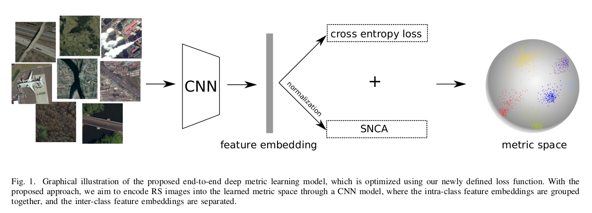

# Deep Metric Learning based on Scalable Neighborhood Components for Remote Sensing Scene Characterization

[Jian Kang](https://github.com/jiankang1991), [Ruben Fernandez-Beltran](https://scholar.google.es/citations?user=pdzJmcQAAAAJ&hl=es), [Zhen Ye](https://scholar.google.com/citations?user=wftJB7QAAAAJ&hl=en), [Xiaohua Tong](https://scholar.google.com/citations?user=Kxn4zKEAAAAJ&hl=en), [Pedram Ghamisi](http://pedram-ghamisi.com/), [Antonio Plaza](https://www.umbc.edu/rssipl/people/aplaza/).

---

This repo contains the codes for the TGRS paper: Deep Metric Learning based on Scalable Neighborhood Components for Remote Sensing Scene Characterization. we propose a new deep metric learning approach, which overcomes the limitation on the class discrimination by means of two different components: 1) scalable neighborhood component analysis (SNCA), which aims
at discovering the neighborhood structure in the metric space; and 2) the cross entropy loss, which aims at preserving the class discrimination capability based on the learned class prototypes. Moreover, in order to preserve feature consistency among all the mini-batches during training, a novel optimization mechanism based on momentum update is introduced for minimizing the proposed loss. The codes are modified from [SNCA](https://github.com/microsoft/snca.pytorch) and [CMC](https://github.com/HobbitLong/CMC).



## Usage
`train_SNCA_CE/main.py` is the script of the proposed SNCA-CE (MB) method for training and validation.
`train_SNCA_CE_MC/main.py` is the script of the proposed SNCA-CE (MU) method for training and validation.

## Citation

```
@article{kang2020deepmetric,
  title={{Deep Metric Learning based on Scalable Neighborhood Components for Remote Sensing Scene Characterization}},
  author={Kang, Jian and Fernandez-Beltran, Ruben and Ye, Zhen and Tong, Xiaohua and Ghamisi, Pedram and Plaza, Antonio},
  journal={IEEE TRANSACTIONS ON GEOSCIENCE AND REMOTE SENSING},
  year={2020},
  note={DOI:10.1109/TGRS.2020.2991657}
  publisher={IEEE}
}

```


